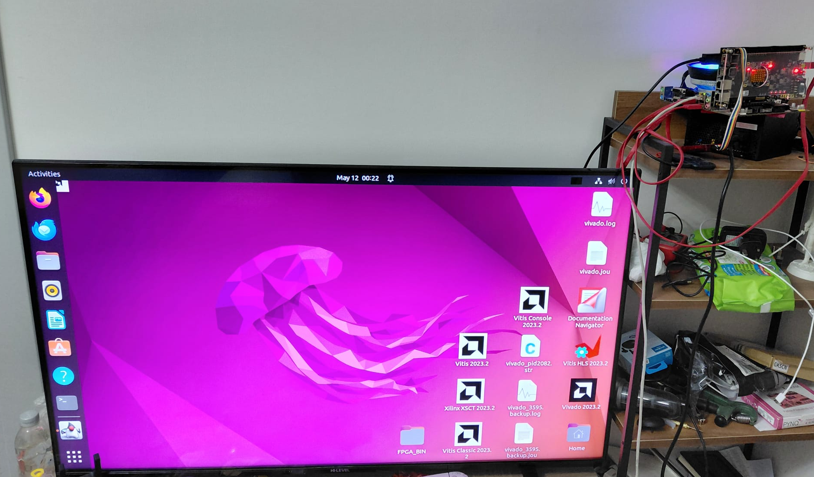

# Simple-Display-Controller
This repo contains Simple Display Controller FPGA hardware, embedded software, and the Linux host driver. The controller aims to enable use of the AX7203 demo board as a display controller connected to a Linux host PC. Display data is sent to the card over PCIe, and the card outputs the frames over HDMI in DVI mode.

This is not a general-purpose GPU. It does not render graphics. It is a display scanout path. Linux produces finished pixels, the driver transports them to the FPGA, and the FPGA outputs them as a video
signal to the monitor.

# Hardware Architecture
AX7203 offers 4 PCIe 2.0 lanes used as the main data path between the Linux host PC and the FPGA. Each frame line is transported as one AXI-stream packet from the XDMA PCIe IP to the VDMA IP. The VDMA write channel saves lines into frame buffers in DDR3 SDRAM, while the VDMA read channel continuously feeds the video output subsystem. The VDMA write channel is configured as GENLOCK master and the read channel as GENLOCK slave so the read channel can switch frames as new frames arrive. The Linux DRM driver configures the video IPs through the XDMA AXI-Lite bypass BAR.

In this Hardware Architecture, the XDMA IP acts as the master of the transfers. Host PC only configures the DMA descriptor tables on the XDMA and instructs to start the transactions but the transactions are done by the XDMA IP, not the HOST PC.

# Current Status of the Project
## Linux DRM Driver
The current `fpga_drm.ko` driver is a whitelist-based DRM/KMS driver. It binds the Xilinx PCIe endpoint, exposes explicit KMS objects for one CRTC, one primary plane, one virtual encoder, and one virtual connector, advertises common 30 Hz and 60 Hz modes up to a `148.5 MHz` pixel clock, accepts linear `XRGB8888` framebuffers, and uploads complete frames through the XDMA H2C stream path. Userspace changes resolution with normal KMS modesets; the driver then reprograms the video clock wizard, VTC, and VDMA for the selected mode through the XDMA bypass BAR.

An experimental overlay path is available with `enable_overlay=1`. It exposes one additional linear `XRGB8888` KMS overlay plane and composites it in CPU code into the existing XDMA upload staging buffers. The default remains `enable_overlay=0`; there is still no `DRIVER_RENDER`, render node, private render ioctl, or Mesa userspace driver.

Supported modes:

| Mode | Pixel clock |
|---|---:|
| `640x480@60` | `25.175 MHz` |
| `640x480@30` | `12.587 MHz` |
| `800x600@60` | `40.000 MHz` |
| `800x600@30` | `20.000 MHz` |
| `1024x768@60` | `65.000 MHz` |
| `1024x768@30` | `32.500 MHz` |
| `1280x720@60` | `74.250 MHz` |
| `1280x720@30` | `37.125 MHz` |
| `1280x1024@60` | `108.000 MHz` |
| `1280x1024@30` | `54.000 MHz` |
| `1920x1080@60` | `148.500 MHz` |
| `1920x1080@30` | `74.250 MHz` |

The current bring-up has been validated with `drm_info`, `modetest -M fpga_drm`, GDM/Xorg desktop pickup, and Vivado ILA capture. With the driver loaded using `debug_logging=1 enable_overlay=1 composition_backend=cpu connector_connected=1 connector_non_desktop=0 enable_fbdev=1`, GDM picked up `/dev/dri/card0` and displayed the desktop through the FPGA output. A direct `modetest` SMPTE pattern upload also produced visible HDMI output. The video-output ILA has been removed from the current hardware, so live stream validation now uses the XDMA ILA at `PCIe_i/xdma_ila/inst/ila_lib`; a recent trigger on `net_slot_0_axis_tvalid` captured 797 `tvalid && tready` handshakes in 1024 samples with nonzero `net_slot_0_axis_tdata`.
The 30 Hz modes keep the same active resolution as their 60 Hz counterparts and lower the video pixel clock; they reduce display-stream bandwidth, but each full-frame PCIe upload still carries `active_width * active_height * 4` bytes.

## Hardware
Hardware supports the driver whitelist up to `1920x1080@60` and the lower-clock 30 Hz variants. Configuration of the IPs is done by `fpga_drm.ko` through the XDMA bypass BAR. The pixel format is 32-bit XRGB on the PCIe input side and 24-bit RGB on the HDMI output side.

# Next Step

## Hardware
Keep the exported `fpga_hardware/PCIe_wrapper/PCIe.hwh` address map synchronized with the Linux driver when the block design changes.
## Linux DRM Driver
The direct KMS overlay test has proven that the optional overlay plane can be committed and CPU-composited into the XDMA upload path; kernel logs showed `overlay=1`. Current next steps are tracked in `doc/project_next_steps.md`: confirm unload-time `cpu_compositions`, improve atomic reject diagnostics, add compositor-friendly plane properties, and test plane assignment with Weston before returning to GNOME/KDE behavior.

Keep the documentation and validation scripts synchronized with the current bypass BAR map and rerun the DRM plus XDMA-ILA validation flow after bitstream or driver changes.
