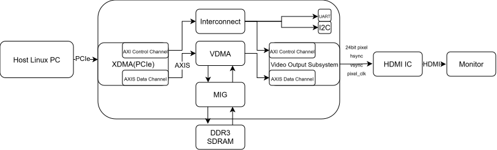
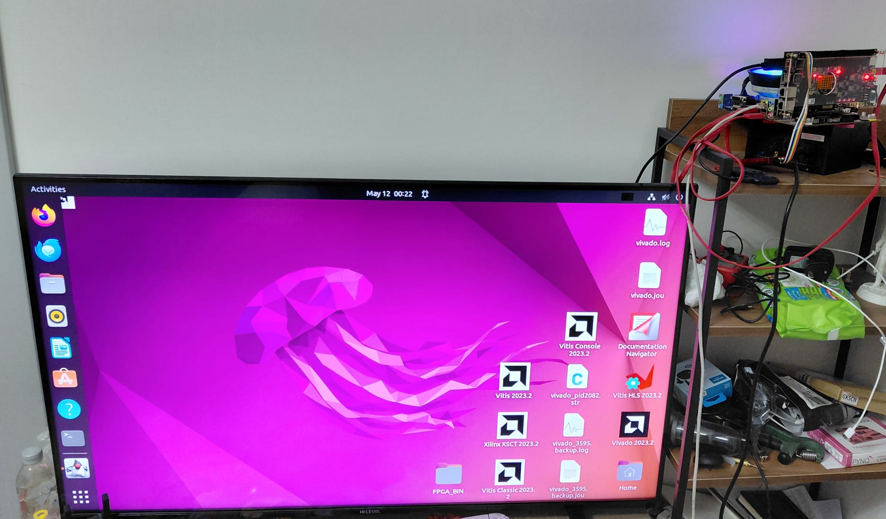

# Simple-Display-Controller
This repo contains Simple Display Controller FPGA hardware, and the Linux host driver. The controller aims to enable use of the AX7203 demo board as a display controller connected to a Linux host PC. Display data is sent to the card over PCIe, and the card outputs the frames over HDMI in DVI mode.

This is not a general-purpose GPU. It does not render graphics. It is a display scanout path. Linux produces finished pixels, the driver transports them to the FPGA, and the FPGA outputs them as a video signal to the monitor.

# Hardware Architecture
AX7203 uses four PCIe 2.0 lanes as the main path between the Linux host and the FPGA. On the host side, `fpga_drm.ko` exposes a DRM/KMS display device, accepts `XRGB8888` framebuffers, and sends complete frames through the XDMA H2C stream engine. The stream format is one active display line per AXI4-Stream packet; each line carries `active_width * 4` bytes and the FPGA ignores the X byte after unpacking.

Inside the FPGA, XDMA feeds AXI VDMA S2MM, which writes the incoming line stream into a DDR3 frame ring. VDMA MM2S continuously reads the active scanout frame into the video pipeline. The video pipeline includes HLS `pixel_unpack` block, the HLS `color_convert` block, AXI4-Stream to Video Out block, and VTC timing generation block.The Linux driver programs VDMA, VTC, video clocking, pixel IP, HDMI I2C setup, and status GPIO through the XDMA AXI-Lite bypass BAR.

The Vivado project includes two useful debug paths: `xdma_ila` observes the H2C stream and bypass activity, while `video_stream_ila` observes video-output status signals.

In this architecture, XDMA acts as the bus master for frame transfers. The host driver prepares DMA descriptors and starts the engine; the XDMA IP performs the PCIe reads and emits the AXI4-Stream line packets into the FPGA fabric.

# Current Status of the Project
## Linux DRM Driver
The current `fpga_drm.ko` driver is DRM/KMS driver. It binds the Xilinx PCIe endpoint, exposes explicit KMS objects for one CRTC, one primary plane, one virtual encoder, and one virtual connector, advertises common 30 Hz and 60 Hz modes up to a `148.5 MHz` pixel clock, accepts linear `XRGB8888` framebuffers, and uploads complete frames through the XDMA H2C stream path. Userspace changes resolution with normal KMS modesets; the driver then reprograms the video clock wizard, VTC, and VDMA for the selected mode through the XDMA bypass BAR.

An experimental overlay path is available with `enable_overlay=1`. It exposes one additional linear `XRGB8888` KMS overlay plane and composites it in CPU code into the existing XDMA upload staging buffers. The overlay accepts same-size source/destination rectangles only: no scaling, no alpha/blend property, no rotation property yet, and the destination rectangle must fit inside the active CRTC mode. The default remains `enable_overlay=0`; there is still no `DRIVER_RENDER`, render node, private render ioctl, or Mesa userspace driver.

Supported modes:

| Mode | Pixel clock |
|---|---:|
| `640x480@60` | `25.175 MHz` |
| `640x480@30` | `12.587 MHz` |
| `800x600@60` | `40.000 MHz` |
| `800x600@30` | `20.000 MHz` |
| `1024x768@60` | `65.000 MHz` |
| `1024x768@30` | `32.500 MHz` |
| `1280x720@60` | `74.250 MHz` |
| `1280x720@30` | `37.125 MHz` |
| `1280x1024@60` | `108.000 MHz` |
| `1280x1024@30` | `54.000 MHz` |
| `1920x1080@60` | `148.500 MHz` |
| `1920x1080@30` | `74.250 MHz` |

The current bring-up has been validated with `drm_info`, `modetest -M fpga_drm`, GDM/Xorg desktop pickup, direct atomic overlay tests. With the driver loaded, GDM picked up `/dev/dri/card0` and displayed the desktop through the FPGA output. Direct `kms_overlay_test` validation proved that a normal atomic KMS client can commit primary plus overlay, that the CPU composition backend is exercised. 

The 30 Hz modes keep the same active resolution as their 60 Hz counterparts and lower the video pixel clock; they reduce display-stream bandwidth, but each full-frame PCIe upload still carries `active_width * active_height * 4` bytes.

## Hardware
Hardware supports the driver whitelist up to `1920x1080@60` and the lower-clock 30 Hz variants. Configuration of the IPs is done by `fpga_drm.ko` through the XDMA bypass BAR. The pixel format is 32-bit XRGB on the PCIe input side and 24-bit RGB on the HDMI output side.

The Linux Vivado recreate flow is documented in `doc/vivado_linux_recreate.md`.

# Next Step

## Hardware

## Linux DRM Driver
Current next steps are tracked in `doc/project_next_steps.md`: add compositor-friendly plane properties starting with immutable `rotation=0`, decide alpha/blend semantics, and test plane assignment with Weston before returning to GNOME/KDE behavior.

