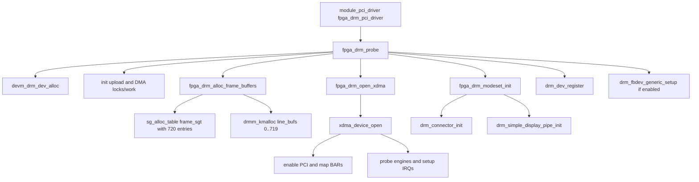
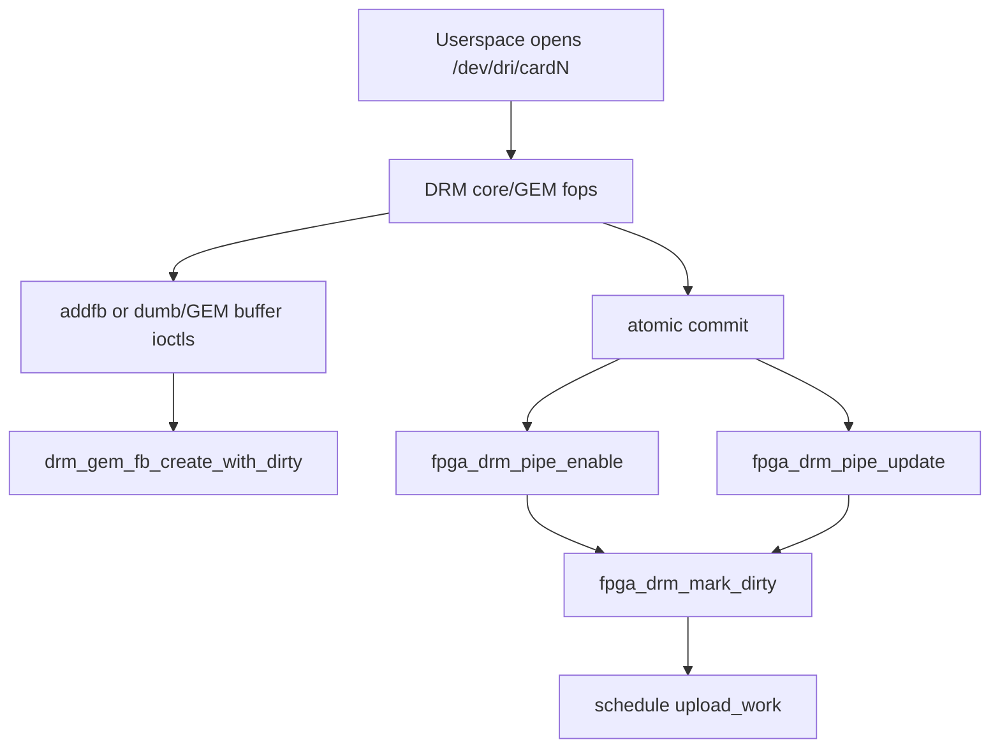
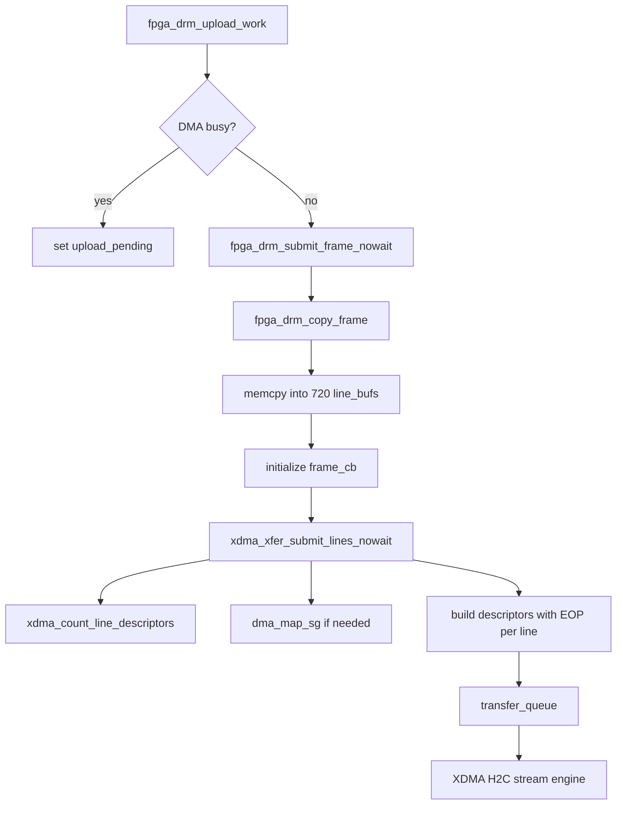
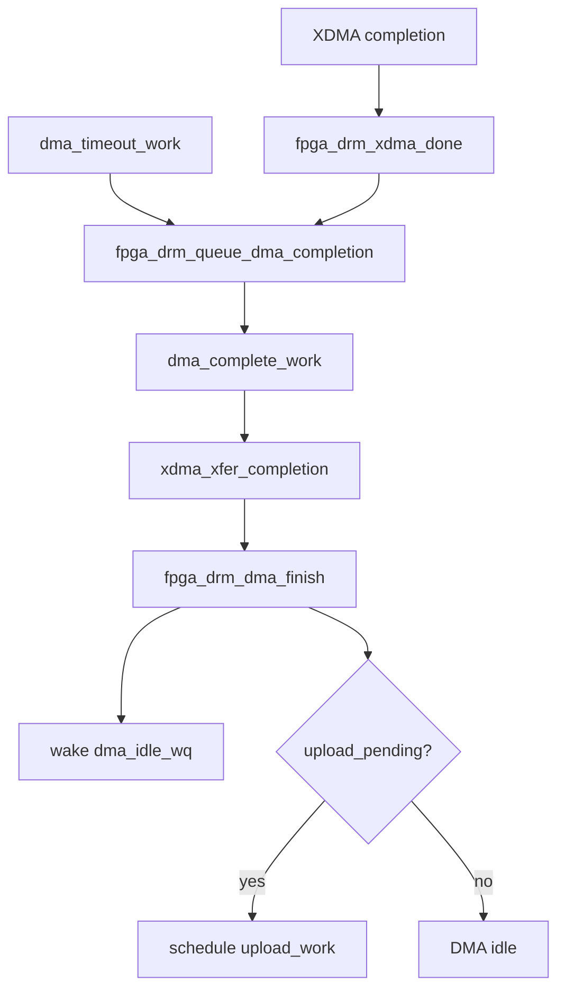
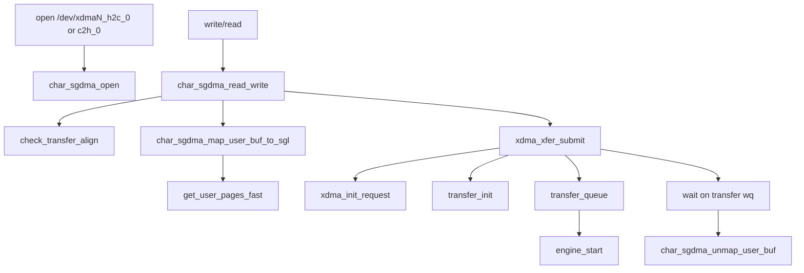
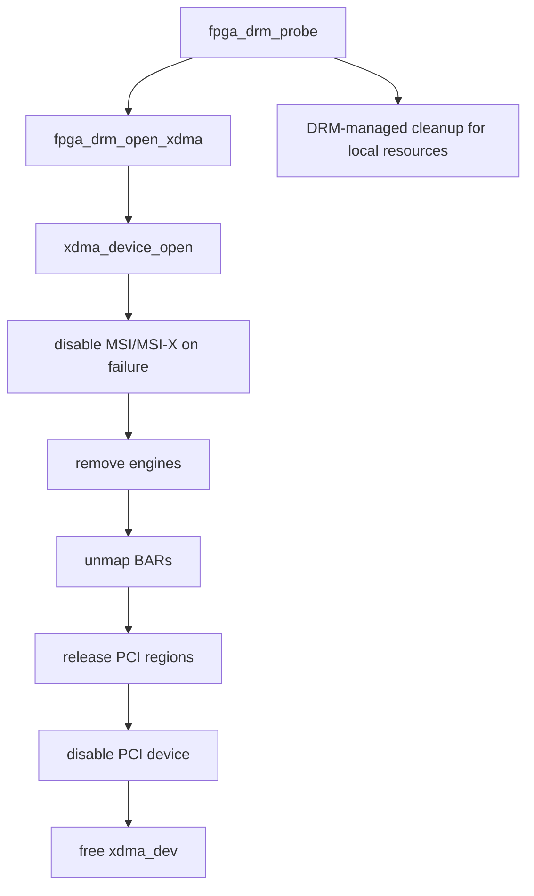

# Call Graphs

## Main Entry Points

| Entry point | Role |
|---|---|
| `fpga_drm_probe()` | PCI probe and DRM/XDMA initialization. |
| `fpga_drm_remove()` | PCI remove and upload shutdown. |
| `fpga_drm_shutdown()` | System shutdown KMS cleanup. |
| `fpga_drm_pipe_enable()` | DRM atomic enable callback. |
| `fpga_drm_pipe_update()` | DRM atomic update callback. |
| `fpga_drm_upload_work()` | Workqueue function that submits the current frame. |
| `fpga_drm_xdma_done()` | XDMA async completion callback. |
| `fpga_drm_dma_complete_work()` | Workqueue completion finalizer. |

## Probe / Init Path

## DRM Userspace Path

## DMA Path Used by `fpga_drm`

## Completion Path

## Standalone XDMA Char Path

This path is documented because the code is present, but it is not compiled
into `fpga_drm.ko`.

## Error Cleanup Path

