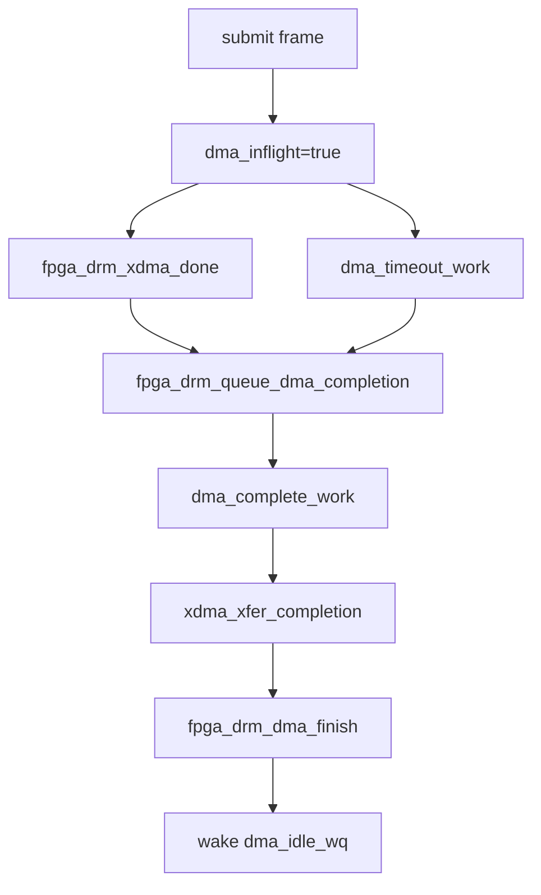

# Concurrency and Locking

## Execution Contexts

| Function | Context |
|---|---|
| `fpga_drm_probe()` / `fpga_drm_remove()` / `fpga_drm_shutdown()` | PCI driver process context. |
| `fpga_drm_pipe_enable()` / `fpga_drm_pipe_disable()` / `fpga_drm_pipe_update()` | DRM atomic commit context. |
| `fpga_drm_upload_work()` | Workqueue context; may sleep. |
| `fpga_drm_xdma_done()` | XDMA completion callback context from `libxdma`. It only records completion and schedules work. |
| `fpga_drm_dma_complete_work()` | Workqueue context; calls `xdma_xfer_completion()`. |
| `fpga_drm_dma_timeout_work()` | Delayed work context; reports timeout into the same completion path. |
| `xdma_isr()` / `xdma_channel_irq()` | Hard IRQ context in `libxdma`. |
| `engine_service_work()` | XDMA workqueue completion context. |

## Driver Locks

| Lock | Type | Protects |
|---|---|---|
| `upload_lock` | mutex | `upload_fb`, `upload_map`, `upload_rect`, and `pipe_enabled`. |
| `dma_lock` | mutex | The submit/completion critical path around `xdma_xfer_submit_lines_nowait()` and `xdma_xfer_completion()`. |
| `dma_state_lock` | spinlock irqsave | `dma_inflight`, `dma_completion_pending`, `dma_completion_err`, and `upload_pending`. |
| `dma_idle_wq` | wait queue | Remove/disable waiting for the in-flight DMA state to become idle. |

The lock order in the DRM path is simple: upload state is captured under
`upload_lock`; DMA submission then happens under `dma_lock`; short state changes
inside submit/completion use `dma_state_lock`.

## Single In-Flight Frame Rule

`fpga_drm_upload_work()` checks `fpga_drm_dma_busy()` before submitting. If a
frame is already running, the function sets `upload_pending`, drops its
temporary framebuffer reference, and returns. `fpga_drm_dma_finish()` schedules
`upload_work` again when it observes that pending flag.

This keeps the 720 line buffers safe. They are not overwritten while the H2C
engine can still read them.

## Completion and Timeout

`fpga_drm_queue_dma_completion()` ignores duplicate completion signals for the
same in-flight frame by checking `dma_completion_pending` under the spinlock.

## Remove and Disable

`fpga_drm_stop_uploads()` cancels `upload_work`, waits briefly for DMA idle,
forces timeout completion if necessary, cancels timeout work, flushes completion
work, and drops the stored framebuffer reference. `fpga_drm_remove()` calls it
after `drm_dev_unplug()` and `drm_atomic_helper_shutdown()`.

## XDMA Core Locks

The vendored XDMA core uses its own locks:

| Lock | Purpose |
|---|---|
| `xdma_engine.desc_lock` | Serializes descriptor allocation/build. |
| `xdma_engine.lock` | Protects engine run state, descriptor accounting, and transfer lists. |
| `xdma_dev.lock` | Protects device online/offline flags. |
| `xdev_mutex` / `xdev_rcu_lock` | Protect global XDMA device lists. |

Those locks are internal to `libxdma`; `fpga_drm_drv.c` interacts with them
through the exported XDMA helper functions.
