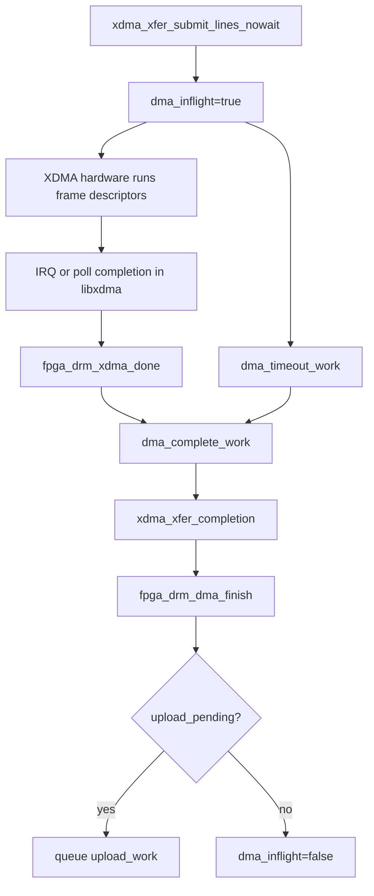
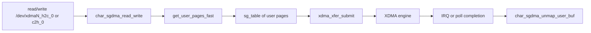

# Data Flow

## Frame Upload Flow

During probe, the DRM driver validates the FPGA video path through the XDMA
bypass BAR and configures static IP state. During KMS enable/modeset it
programs the clock wizard, VTC, and VDMA for the selected whitelist mode. At
runtime it moves pixels from a GEM SHMEM framebuffer into host line buffers and
submits the whole active-mode frame to XDMA asynchronously.

```mermaid
flowchart LR
    Probe[fpga_drm_probe] --> Pipeline[configure static video IPs through XDMA bypass BAR]
    CB --> Mode[program selected mode clock/VTC/VDMA]
    Mode --> VDMA[VDMA frame ring in DDR]
    App[DRM userspace compositor or test app] --> DRM[DRM atomic commit]
    DRM --> Plane[Shadow plane map]
    Plane --> CB[fpga_drm_pipe_enable/update]
    CB --> Dirty[fpga_drm_mark_dirty]
    Dirty --> Work[upload_work]
    Work --> Copy[fpga_drm_copy_frame]
    Copy --> Lines[1080 max-width line_bufs]
    Lines --> SGT[active-mode SG view]
    SGT --> Submit[xdma_xfer_submit_lines_nowait]
    Submit --> Desc[XDMA descriptors with EOP per line]
    Desc --> PCIe[PCIe DMA reads host line buffers]
    PCIe --> FPGA[VDMA S2MM H2C AXI-stream sink]
    FPGA --> VDMA
```

## Ownership

| Object | Owner | Lifetime |
|---|---|---|
| DRM framebuffer | DRM core/userspace GEM object | Referenced by `fpga_drm_mark_dirty()` while stored as `upload_fb`; temporary work reference is held by `fpga_drm_upload_work()`. |
| `upload_fb`, `upload_map`, `upload_rect` | `struct fpga_drm_device` | Protected by `upload_lock`; cleared by `fpga_drm_stop_uploads()`. |
| `line_bufs[1080]` | `struct fpga_drm_device` | Allocated once by `fpga_drm_alloc_frame_buffers()` and reused after the in-flight DMA completes. |
| `frame_sgt` | `struct fpga_drm_device` | Persistent max-height SG table, one entry per line buffer. |
| `active_frame_sgt` | `struct fpga_drm_device` | Per-submit SG view using only the active mode height and line byte size. |
| `frame_cb.req` | XDMA async request | Set by `xdma_xfer_submit_lines_nowait()` and released by `xdma_xfer_completion()`. |

## Validity Rules

| Stage | Required condition | Function |
|---|---|---|
| Frame accepted | Format is XRGB8888, width/height match the active mode, and pitch is at least `active_width * 4`. | `fpga_drm_copy_frame()` |
| Host staging complete | All active source lines have been copied into `line_bufs[]`. | `fpga_drm_copy_frame()` |
| DMA submission accepted | `xdma_xfer_submit_lines_nowait()` returns `-EIOCBQUEUED`. | `fpga_drm_submit_frame_nowait()` |
| DMA completion handled | Callback or timeout queues `dma_complete_work`. | `fpga_drm_xdma_done()`, `fpga_drm_dma_timeout_work()` |
| Frame complete | `xdma_xfer_completion()` returns exactly the active mode frame byte count. | `fpga_drm_dma_complete_work()` |

## Completion Flow

Only one frame is submitted at a time. Updates that arrive while the H2C engine
is busy are collapsed into a pending upload of the latest framebuffer state.

## Standalone XDMA Data Flow

This path is present in the repository but not compiled into `fpga_drm.ko`.

## Notes

`upload_full_frame` defaults to true. If it is set false, the driver merges
dirty rectangles in `fpga_drm_mark_dirty()`, but the current submit path still
copies and uploads the complete active-mode frame.
