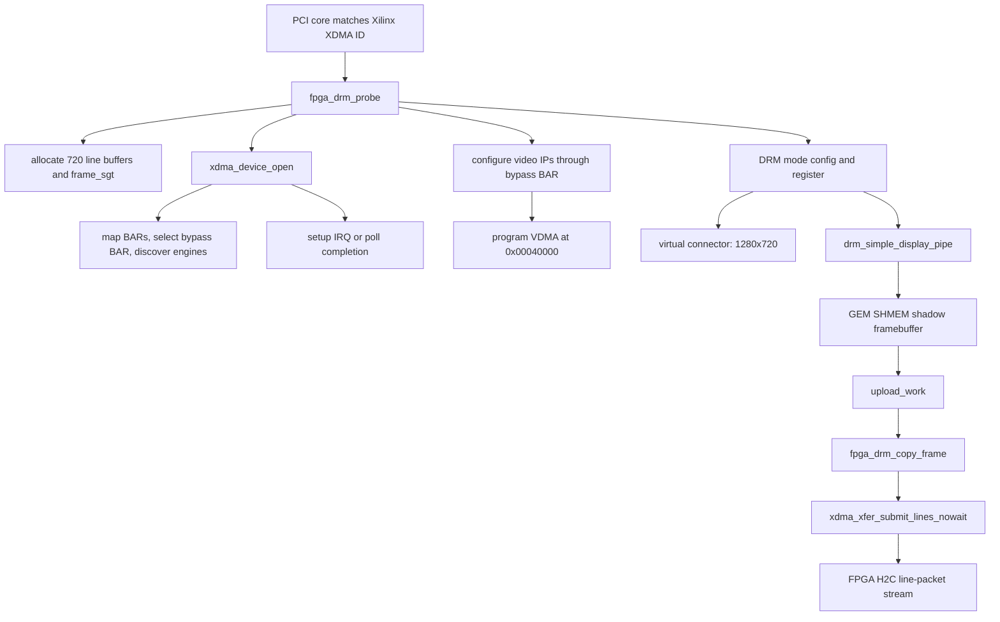

# Driver Architecture

## Scope

This tree contains two driver surfaces:

| Surface | Built from | Purpose |
|---|---|---|
| `fpga_drm.ko` | `Linux_DRM_Driver/fpga_drm/fpga_drm_drv.c` plus the linked XDMA core files | Fixed-mode DRM/KMS display driver for the FPGA HDMI output. |
| standalone `xdma.ko` | `XDMA_driver/xdma/*.c` | Xilinx reference XDMA character-device driver. It is not loaded at the same time as `fpga_drm.ko`. |

Unless stated otherwise, "the driver" means `fpga_drm.ko`.

## High-Level Design

`fpga_drm.ko` owns one PCIe XDMA function and exposes it as one DRM display. It
uses normal DRM helpers for mode setting and framebuffer memory, programs the
FPGA video pipeline through the XDMA bypass BAR during probe, then uses the
vendored XDMA core to transfer the committed framebuffer to the FPGA.

| Contract | Current implementation |
|---|---|
| Fixed display mode | `FPGA_DRM_WIDTH`, `FPGA_DRM_HEIGHT`, and `fpga_drm_mode` define 1280x720@60. |
| Pixel format | `fpga_drm_formats[]` advertises `DRM_FORMAT_XRGB8888`; `fpga_drm_copy_frame()` validates format and size. |
| Frame staging | `fpga_drm_alloc_frame_buffers()` allocates 720 line buffers and one 720-entry `frame_sgt`. |
| Video-IP setup | `fpga_drm_configure_pipeline()` programs pixel unpack, color convert, VDMA, HDMI I2C, VTC, and debug readbacks. |
| DMA submission | `fpga_drm_submit_frame_nowait()` calls `xdma_xfer_submit_lines_nowait()`. |
| Completion | `fpga_drm_xdma_done()` queues `dma_complete_work`; timeout is handled by `dma_timeout_work`. |

## Hardware Blocks

| Block | Driver interaction |
|---|---|
| PCIe endpoint | Matched through `fpga_drm_pci_ids`; `libxdma` enables the device, maps BARs, sets the DMA mask, and configures IRQs. |
| XDMA AXI-Lite bypass BAR | Required at probe for this hardware; `xdma_device_bypass_bar()` exposes it to the DRM side for video-IP registers. |
| XDMA H2C AXI-stream engine | Used by `xdma_xfer_submit_lines_nowait()` with `write=true`, `line_size=5120`, and `line_count=720`. |
| FPGA video path | VDMA S2MM captures H2C line packets into DDR frame buffers; VDMA MM2S feeds pixel unpack, color convert, and HDMI timing. |
| Host video IP setup | Linux programs the fixed bypass BAR address map from `PCIe.hwh`, including VDMA at `0x00040000`. |

## Main Files

| File | Responsibility |
|---|---|
| `Linux_DRM_Driver/fpga_drm/fpga_drm_drv.c` | PCI binding, video-pipeline setup, DRM setup, connector/mode handling, framebuffer tracking, async frame upload, and remove/shutdown. |
| `Linux_DRM_Driver/fpga_drm/Makefile` | Builds `fpga_drm.ko` from the DRM wrapper and the required XDMA core files. |
| `XDMA_driver/include/libxdma_api.h` | In-kernel XDMA API used by the DRM driver, including `xdma_device_open()`, user/bypass BAR accessors, `xdma_xfer_submit_lines_nowait()`, and `xdma_xfer_completion()`. |
| `XDMA_driver/xdma/libxdma.c` | XDMA PCI/BAR/IRQ/descriptor/engine implementation. |
| `XDMA_driver/xdma/xdma_thread.c` | Optional polling-mode completion threads used by `libxdma` when `poll_mode=1`. |
| `XDMA_driver/xdma/xdma_mod.c` and `cdev_*.c` | Standalone XDMA module and character devices. These are reference/utility code, not part of `fpga_drm.ko`. |

## Important State

| State | Purpose |
|---|---|
| `struct fpga_drm_device` | Per-device DRM, PCI, XDMA, connector, pipe, upload, DMA, and diagnostic state. |
| `frame_sgt` | 720-entry SG table, one entry per line buffer. |
| `line_bufs[720]` | DRM-managed host buffers containing the frame currently submitted to XDMA. |
| `frame_cb` | `struct xdma_io_cb` used for async XDMA callback and request tracking. |
| `upload_fb`, `upload_map`, `upload_rect` | Latest framebuffer state captured from DRM shadow-plane callbacks. |
| `dma_inflight`, `dma_completion_pending`, `upload_pending` | Serialized async frame-upload state. |

## Subsystems

| Subsystem | Usage |
|---|---|
| PCI | `module_pci_driver(fpga_drm_pci_driver)` binds the XDMA function. |
| DRM/KMS | `drm_simple_display_pipe`, connector helpers, atomic helpers, GEM SHMEM helpers. |
| fbdev | `drm_fbdev_generic_setup(drm, 32)` when `enable_fbdev=1`. |
| DMA mapping | Performed inside `libxdma` for the frame SG table. |
| IRQ/workqueues | XDMA IRQ/poll completion is handled by `libxdma`; DRM frame completion is finalized in `dma_complete_work`. |

## Architecture Diagram

## Coexistence Rule

`fpga_drm.ko` and standalone `xdma.ko` match the same PCI function. Unload the
standalone `xdma` module before loading `fpga_drm.ko`, or bind the device
explicitly to the desired driver.
