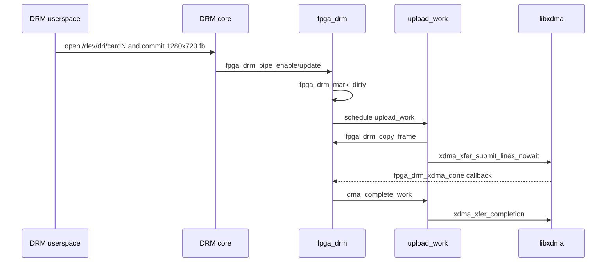

# Driver Lifecycle

## Module Load to DRM Device

| Phase | Function | Behavior |
|---|---|---|
| Module load | `module_pci_driver(fpga_drm_pci_driver)` | Registers the PCI driver. |
| PCI match | `fpga_drm_pci_ids` | Matches supported Xilinx XDMA device IDs. |
| Probe | `fpga_drm_probe()` | Allocates DRM state, initializes upload/DMA state, allocates frame buffers, opens XDMA, initializes KMS, and registers DRM. |
| Userspace visible | `drm_dev_register()` | Creates `/dev/dri/cardN` and DRM sysfs entries. |
| fbdev setup | `drm_fbdev_generic_setup(drm, 32)` | Runs when `enable_fbdev=1`, the current default. |

Standalone `xdma.ko` has a separate lifecycle and creates `/dev/xdma*` nodes.
It should not own the same PCI function while `fpga_drm.ko` is loaded.

## Probe Details

| Step | Function |
|---|---|
| Allocate device | `devm_drm_dev_alloc()` |
| Initialize locks/work | `mutex_init()`, `spin_lock_init()`, `init_waitqueue_head()`, `INIT_WORK()`, `INIT_DELAYED_WORK()` |
| Allocate frame staging | `fpga_drm_alloc_frame_buffers()` |
| Open XDMA | `fpga_drm_open_xdma()` then `xdma_device_open()` |
| Initialize KMS | `fpga_drm_modeset_init()` |
| Bind PCI data | `pci_set_drvdata(pdev, drm)` |
| Register DRM device | `drm_dev_register(drm, 0)` |
| Optional fbdev | `drm_fbdev_generic_setup(drm, 32)` |

## XDMA Open and Close

`fpga_drm_open_xdma()` calls `xdma_device_open()` from the vendored core. That
core enables the PCI device, requests regions, maps BARs, sets DMA masks,
discovers engines, allocates descriptor resources, and sets up IRQs or polling.

Close runs through the DRM-managed `fpga_drm_close_xdma()` action and calls
`xdma_device_close()`, which tears down interrupts, engines, BAR mappings,
regions, PCI enable state, and the XDMA device object.

## Userspace Commit to Frame Upload

## Remove and Shutdown

| Phase | Function | Behavior |
|---|---|---|
| Remove | `fpga_drm_remove()` | Unplugs DRM, shuts down atomic state, stops uploads. |
| Stop uploads | `fpga_drm_stop_uploads()` | Cancels upload work, waits or forces DMA completion, drops framebuffer reference. |
| Managed cleanup | DRM-managed actions | Frees SG table and closes XDMA. |
| Shutdown | `fpga_drm_shutdown()` | Runs `drm_atomic_helper_shutdown()` when a DRM device exists. |

No suspend/resume or runtime PM callbacks are implemented.
