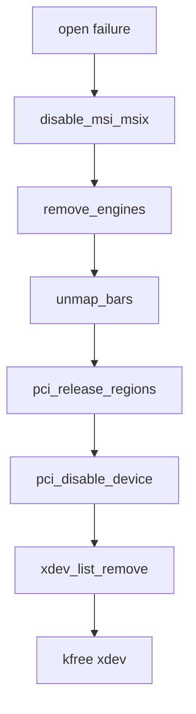

# Error Paths

## Probe Error Handling

`fpga_drm_probe()` uses managed allocations where possible. Most failures
return directly after the helper that failed has either not acquired resources
or has registered managed cleanup.

| Step | Failure | Cleanup |
|---|---|---|
| `devm_drm_dev_alloc()` | `PTR_ERR(fpga)` | Device-managed allocation handles partial state. |
| `fpga_drm_alloc_frame_buffers()` | `-ENOMEM` or SG allocation error | DRM-managed line buffers; `frame_sgt` cleanup is registered after allocation. |
| `fpga_drm_open_xdma()` | `-ENODEV`, missing MMIO BAR, invalid channel, or managed action failure | Helper closes XDMA on missing BAR or invalid channel; action-or-reset closes on action registration failure. |
| `fpga_drm_modeset_init()` | DRM helper error | DRM-managed mode config where applicable. |
| `drm_dev_register()` | DRM registration error | Managed cleanup on probe unwind. |
| `drm_fbdev_generic_setup()` | Return value not checked | Generic fbdev helper behavior; called only when `enable_fbdev=1`. |

## Frame Submit Errors

| Function | Error behavior |
|---|---|
| `fpga_drm_copy_frame()` | Returns `-EINVAL` for missing CPU mapping, non-XRGB8888 format, wrong size, or too-small pitch. |
| `fpga_drm_submit_frame_nowait()` | Clears in-flight state and wakes waiters if async submit does not return `-EIOCBQUEUED`. |
| `fpga_drm_upload_work()` | Increments `upload_failures`, logs a rate-limited submit error, and drops the temporary framebuffer reference. |
| `xdma_xfer_submit_lines_nowait()` | Returns validation, mapping, descriptor, engine-busy, or queueing errors before a request is accepted. |

## Frame Completion Errors

| Function | Error behavior |
|---|---|
| `fpga_drm_xdma_done()` | Records callback error and schedules completion work. |
| `fpga_drm_dma_timeout_work()` | Records `-ETIMEDOUT` and schedules completion work. |
| `fpga_drm_dma_complete_work()` | Calls `xdma_xfer_completion()` when `frame_cb.req` exists, then clears the request pointer. |
| `fpga_drm_dma_finish()` | Treats nonzero completion error or wrong completed byte count as failure, clears in-flight state, wakes waiters, and schedules a pending upload if needed. |

Duplicate callback/timeout reports for the same frame are suppressed by
`fpga_drm_queue_dma_completion()` using `dma_completion_pending`.

## Remove Cleanup

| Cleanup step | Function |
|---|---|
| Stop new userspace access | `drm_dev_unplug()` |
| Shut down KMS state | `drm_atomic_helper_shutdown()` |
| Cancel pending upload work | `cancel_work_sync(&upload_work)` |
| Wait or force completion | `wait_event_timeout()` and `fpga_drm_queue_dma_completion(..., -ETIMEDOUT)` |
| Stop timeout/completion work | `cancel_delayed_work_sync()` and `flush_work()` |
| Drop framebuffer reference | `drm_framebuffer_put()` |
| Close XDMA | DRM-managed `fpga_drm_close_xdma()` |

## XDMA Core Open Cleanup

`xdma_device_open()` unwinds in this order on failure:

## Current Residual Risks

| Area | Status |
|---|---|
| `drm_fbdev_generic_setup()` return | Not checked; common for helper setup, but failures would be visible only through logs or missing fbdev. |
| Forced timeout during remove | The driver can force completion accounting, but the lower XDMA engine still owns its own hardware state. |
| Standalone XDMA cdev error paths | Present in repository but not part of `fpga_drm.ko`; keep separate from display-driver behavior. |
