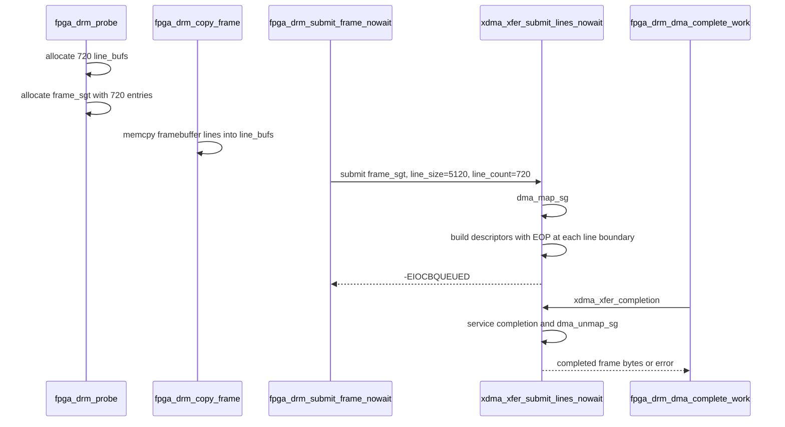

# Memory and DMA

## `fpga_drm` Allocations

| Allocation | Function | Owner | Free path |
|---|---|---|---|
| `struct fpga_drm_device` | `devm_drm_dev_alloc()` in `fpga_drm_probe()` | Device-managed DRM object | Device-managed cleanup. |
| `frame_sgt` | `sg_alloc_table(..., FPGA_DRM_HEIGHT, ...)` in `fpga_drm_alloc_frame_buffers()` | `struct fpga_drm_device` | `fpga_drm_free_frame_sgt()` via DRM-managed action. |
| `line_bufs[720]` | `drmm_kmalloc(..., FPGA_DRM_LINE_BYTES, ...)` | `struct fpga_drm_device` | DRM-managed cleanup. |
| XDMA core device | `xdma_device_open()` | `libxdma` | `xdma_device_close()` via `fpga_drm_close_xdma()`. |
| XDMA descriptor pool | `engine_alloc_resource()` | Per XDMA engine | `engine_free_resource()`. |
| XDMA request | `xdma_xfer_submit_lines_nowait()` | Current async frame upload | `xdma_xfer_completion()` or submit error path. |

The display frame staging area is 720 * 5120 bytes, split across 720 line
buffers. The SG table points at those line buffers for the lifetime of the DRM
device.

## Frame DMA Lifecycle

## Descriptor Behavior

`xdma_xfer_submit_lines_nowait()` builds one async request for the full frame.
It walks the SG table, splits entries by `desc_blen_max` as needed, and marks
line boundaries with `XDMA_DESC_EOP`. The final descriptor also gets
`XDMA_DESC_STOPPED` and `XDMA_DESC_COMPLETED`.

| Stage | Function |
|---|---|
| Map host buffers | `dma_map_sg()` when `dma_mapped=false`. |
| Count descriptors | `xdma_count_line_descriptors()`. |
| Allocate request | `xdma_request_alloc()`. |
| Initialize descriptors | `xdma_desc_set()` and `xdma_desc_control_set()`. |
| Queue hardware transfer | `transfer_queue()`. |
| Complete/unmap/free | `xdma_xfer_completion()`. |

## Buffer Ownership

| Buffer | Hardware may access it? | Lifetime rule |
|---|---|---|
| `line_bufs[]` | Yes, while `dma_inflight=true`. | Reused only after `fpga_drm_dma_finish()` clears in-flight state. |
| DRM framebuffer map | No direct DMA access by XDMA. | CPU copies from it while a framebuffer reference is held. |
| XDMA descriptors | Yes, while engine runs. | Owned by the XDMA engine descriptor pool. |
| Standalone XDMA user pages | Yes in standalone `xdma.ko` char paths. | Pinned until char-device transfer completion. |

## Serialization

The DRM path intentionally has a single in-flight frame. `dma_lock` serializes
submit/completion work, `dma_state_lock` protects in-flight flags, and
`upload_pending` records that another frame should be submitted after the
current frame completes.

## Standalone XDMA Memory

The vendored standalone driver also contains user-page pinning, async AIO
state, performance buffers, poll-mode writeback memory, and character-device
objects. Those allocations are not part of the `fpga_drm.ko` userspace ABI.
