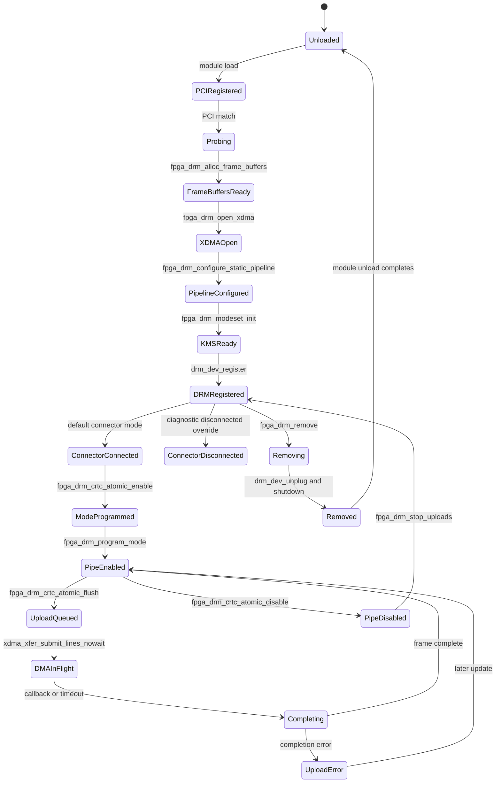
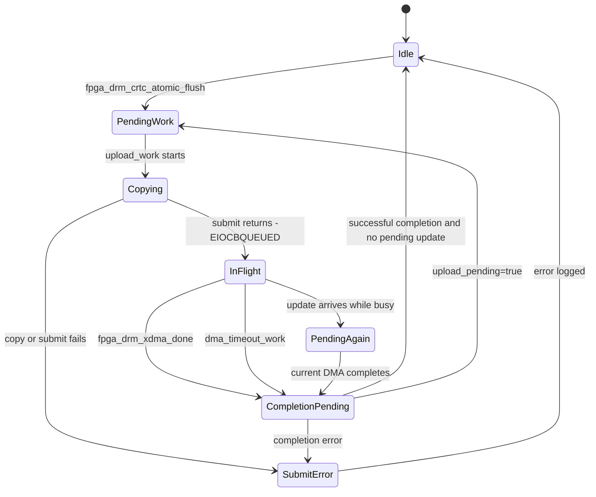

# State Machine

## Device State

The driver does not define a formal device-state enum. This diagram reflects
the current state represented by PCI/DRM lifetime and fields in
`struct fpga_drm_device`.

## State Descriptions

| State | Meaning |
|---|---|
| `FrameBuffersReady` | 1080 max-width line buffers and `frame_sgt` have been allocated. |
| `XDMAOpen` | `xdma_device_open()` succeeded, the bypass BAR is selected for MMIO, and the selected H2C channel is valid. |
| `PipelineConfigured` | Static video IP state such as pixel unpack, color convert, HDMI I2C, and video-lock GPIO has been programmed through the bypass BAR. |
| `KMSReady` | Mode config, explicit CRTC, primary plane, optional overlay plane, virtual encoder, and virtual connector exist. |
| `DRMRegistered` | Userspace can see `/dev/dri/cardN`. |
| `ConnectorConnected` | The driver advertises the supported-mode whitelist. This is the default. |
| `ModeProgrammed` | Clock wizard, VDMA, and VTC have been programmed for the selected KMS mode. |
| `ConnectorDisconnected` | Diagnostic mode when the connector is manually forced disconnected. |
| `DMAInFlight` | One async frame upload is queued in the XDMA core. |
| `Completing` | Callback or timeout has scheduled `dma_complete_work`. |

## Upload State

## Software Transitions

| Transition | Function |
|---|---|
| Userspace commit to validated plane state | `fpga_drm_primary_atomic_check()` / `fpga_drm_overlay_atomic_check()` |
| Plane state to queued work | `fpga_drm_crtc_atomic_flush()` |
| Queued work to in-flight DMA | `fpga_drm_upload_work()` and `fpga_drm_submit_frame_nowait()` |
| In-flight DMA to completion work | `fpga_drm_xdma_done()` or `fpga_drm_dma_timeout_work()` |
| Completion work to idle or retry | `fpga_drm_dma_finish()` |
| Active display to stopped uploads | `fpga_drm_crtc_atomic_disable()` / `fpga_drm_stop_uploads()` |

## XDMA Transfer State

The XDMA core retains its own transfer states in `libxdma.h`:

| Enum | Meaning |
|---|---|
| `TRANSFER_STATE_NEW` | Transfer object has not been queued. |
| `TRANSFER_STATE_SUBMITTED` | Transfer is on the engine queue. |
| `TRANSFER_STATE_COMPLETED` | Expected descriptors completed. |
| `TRANSFER_STATE_FAILED` | Hardware or software marked the transfer failed. |
| `TRANSFER_STATE_ABORTED` | Transfer was removed during timeout/offline handling. |

The DRM driver observes that state only through the return value of
`xdma_xfer_completion()` and its async callback.
