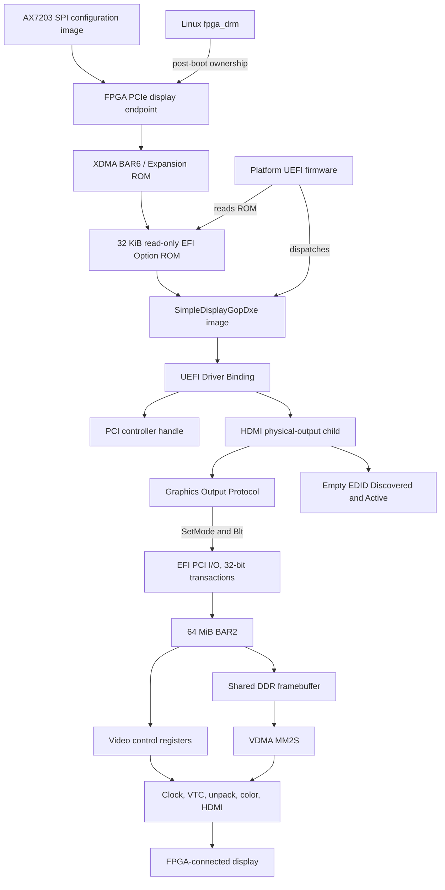

# UEFI GOP Architecture

## Scope

The Simple Display UEFI path turns the AX7203 PCIe display endpoint into a
pre-OS graphics device. The FPGA stores an X64 UEFI driver in its Expansion ROM,
firmware dispatches that image, Driver Binding creates one HDMI child, and a
GOP consumer writes pixels through the driver's BLT interface. The FPGA VDMA
reads those pixels from shared DDR and feeds the existing HDMI pipeline.

This path is a display controller, not a rendering engine. It accepts finished
pixels and scans them out. It does not expose a UEFI acceleration API, command
processor, shader interface, or general-purpose linear framebuffer.

## Layered Design

| Layer | Responsibility |
|---|---|
| PCIe/XDMA endpoint | Enumerates `10ee:7024`, exposes BAR2, and advertises Expansion ROM BAR6 |
| ROM adaptation | Decodes BAR ID 6 and serves a fixed read-only 32 KiB ROM image |
| Platform firmware | Reads PCIR metadata, loads the X64 EFI image, and invokes its entry point |
| Driver Binding | Matches the PCI controller, enables memory decode, and creates one HDMI child |
| GOP child | Publishes GOP, device path, EDID Discovered, and EDID Active protocols |
| Hardware library | Validates SDC1/BAR2 and programs clock, HDMI, VDMA MM2S, VTC, pixel unpack, and color conversion |
| GOP consumer | Calls `SetMode()` and `Blt()`; firmware setup and GRUB are real consumers |
| FPGA scanout | VDMA MM2S reads XRGB8888 storage and the video pipeline emits RGB over HDMI/DVI |
| Linux handoff | `fpga_drm` later binds the same PCI function and reinitializes native DRM scanout |

## System Diagram



## Firmware Component Boundaries

The DXE driver owns UEFI Driver Model integration and GOP semantics. It does
not duplicate register programming. The shared hardware library owns PCI
identity checks, BAR discovery, SDC1 validation, mode programming, scratch
testing, and status reads. The bring-up and GOP-test applications are explicit
diagnostics; neither is required for automatic production boot.

The driver's `Start()` deliberately performs no visible modeset. It publishes
an uninitialized GOP object with `Mode=MAX_UINT32`. A consumer must call
`SetMode()` before `Blt()` can access visible storage. This keeps device
discovery from unexpectedly changing the display.

## Public Display Model

The child represents the physical HDMI output, not the PCI function itself. It
has an ACPI ADR device-path node for an external digital display and installs:

- `EFI_GRAPHICS_OUTPUT_PROTOCOL`;
- `EFI_EDID_DISCOVERED_PROTOCOL` with no EDID bytes;
- `EFI_EDID_ACTIVE_PROTOCOL` with no EDID bytes; and
- the appended physical-output device path.

The GOP advertises one fixed `1920x1080@60` mode. `PixelBltOnly` is essential:
BAR2 requires ordered 32-bit PCI I/O semantics, so the driver cannot safely
publish its storage as an ordinary CPU-addressable framebuffer. All pixel
access is mediated by `GOP.Blt()` and `FrameBufferBase`/`FrameBufferSize` stay
zero.

## Hardware Programming Model

BAR2 translates to FPGA AXI base `0x3c000000`. Low offsets expose video control
blocks, SDC1 is at `+0x00080000`, and the upper shared-DDR window begins at
`+0x02000000`. The framebuffer therefore has two equivalent addresses:

```text
host view:  BAR2 + 0x02000000
FPGA view:  AXI 0x3e000000
```

`SetMode()` programs the pipeline for the selected timing, updates the GOP mode
state, then clears the complete visible frame to black through `Blt()`. VDMA
MM2S is programmed with one frame store at FPGA address `0x3e000000`, a stride
of `horizontal_active * 4`, and the active height.

## Expansion ROM Boundary

The Expansion ROM path is an experimental adaptation around generated XDMA
4.1 sources, not a supported high-level XDMA feature. The tracked flow fixes
both the outer XDMA and nested `pcie_7x` configuration, repairs BAR-hit decoding
so `m_axis_rx_tuser[8]` becomes internal BAR ID 6, and attaches a read-only AXI
ROM at translated address `0x01000000`.

ROM readability proves transport only. EFI dispatch, Driver Binding, child
creation, protocol behavior, visible output, persistence, and Linux handoff
remain independent architecture layers.

## Coexistence and Handoff

During Shell validation the motherboard iGPU remains the console while the
Simple Display child drives the FPGA-attached display. Targeted bind,
disconnect, and reconnect must not remove or disturb the iGPU GOP.

At OS boot the UEFI GOP advertises no linear framebuffer, preventing Linux
`simpledrm` from treating BAR2 as normal CPU memory. Linux `fpga_drm` then binds
the PCI function, reprograms the pipeline, and owns subsequent scanout. UEFI
Boot Services protocols do not remain a runtime control API for Linux.

## Non-Goals

- Runtime Services graphics after `ExitBootServices()`.
- Arbitrary EDID-derived modelines.
- A CPU-mappable GOP framebuffer.
- Sharing UEFI protocol ownership with `fpga_drm` concurrently.
- Proving normal XDMA H2C behavior from ROM or GOP evidence.
- Replacing the Linux DRM/KMS interface.
