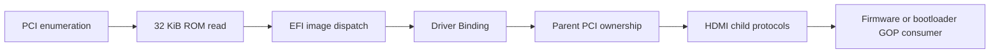
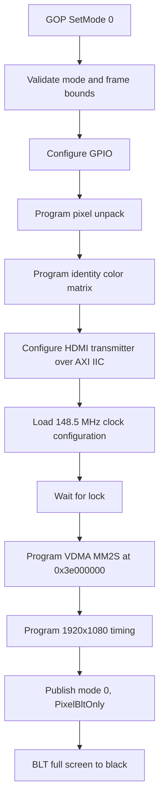
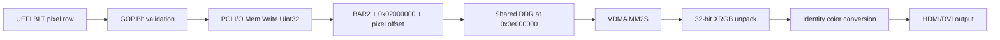
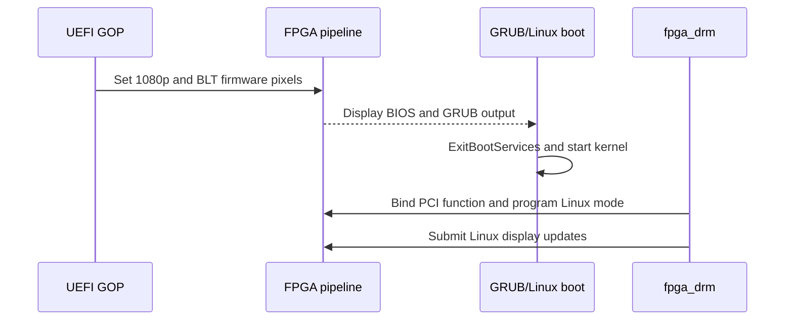

# Data Flow

## Automatic Discovery Flow



Each arrow is conditional. A valid PCI function can expose unreadable or wrong
ROM bytes; valid ROM bytes can contain a rejected EFI image; a dispatched
driver can fail to bind; a child can exist before a consumer selects a mode.

## Mode-Programming Flow



Driver Binding `Start()` is absent from this diagram because it deliberately
does not program a mode or alter visible pixels.

## Pixel Write Flow

For `EfiBltBufferToVideo` and `EfiBltVideoFill`:



The byte address for pixel `(x,y)` is:

```text
BAR2 + 0x02000000 + ((y * PixelsPerScanLine) + x) * 4
```

At 1920 pixels per line, each complete PCI I/O row contains 1920 32-bit
elements and the frame contains 1080 rows.

## Pixel Read Flow

`EfiBltVideoToBltBuffer` reverses the host side of the path:

```text
shared DDR -> BAR2 -> PCI I/O Mem.Read Uint32 -> caller's BLT buffer
```

It reads stored pixels, not the post-conversion HDMI signal. It proves BAR
round-trip storage semantics and the driver implementation; it does not sample
the physical display link.

## Video-to-Video Copy

The driver cannot use `memmove()` on BAR2. It reads a source row through PCI
I/O into a temporary host buffer, then writes that row through PCI I/O to the
destination. When the destination begins below the source, rows are processed
bottom-up; otherwise they are processed top-down.

This combines safe vertical order with a complete row snapshot, preserving
both vertical and horizontal overlap.

## Address Ownership

| Address/storage | Writer | Reader |
|---|---|---|
| Option ROM at AXI `0x01000000` | Build-time memory initialization only | PCIe root complex through BAR6 |
| SDC1 at BAR2 `+0x00080000` | Fixed RTL constants | UEFI and Linux diagnostics |
| Video control blocks | UEFI hardware library, later `fpga_drm` | UEFI/Linux status paths and FPGA IP |
| GOP framebuffer DDR | GOP BLT through PCI I/O | GOP readback and VDMA MM2S |
| Scratch page | Diagnostic save/write/restore only | Same diagnostic |

The ROM is read-only. GOP pixel traffic never targets the ROM AXI address, and
ROM traffic never aliases the BAR2 display/control address range.

## Manual Validation Flow

```text
UEFI Shell on iGPU
  -> optional SimpleDisplayBringup.efi diagnostic
  -> load SimpleDisplayGopDxe.efi
  -> targeted connect of 10ee:7024
  -> Simple Display child appears beside iGPU GOP
  -> SimpleDisplayGopTest.efi selects mode and exercises BLTs
  -> targeted disconnect removes only FPGA child
  -> raw PCI Command returns exactly to entry value
  -> targeted reconnect creates new FPGA child
  -> GOP test passes again
```

For the cold-bind packaging gate, the bring-up application is intentionally
not run. This proves the driver enables memory decode and initializes its own
hardware prerequisites rather than inheriting them from a diagnostic.

## Firmware-to-Linux Flow



There is no shared protocol or live synchronization between GOP and DRM.
`PixelBltOnly` ensures Linux does not infer a linear simple framebuffer from
the GOP mode. `fpga_drm` becomes the only runtime PCI driver owner.

## Independent Paths

Do not infer one of these from another:

- ROM BAR6 reads and BAR2 register/framebuffer transactions use different
  address paths.
- Direct BAR2 GOP writes do not prove XDMA H2C streaming.
- VDMA MM2S scanout does not prove physical visibility unless the display is
  observed or the output path is otherwise measured.
- GOP protocol readback does not prove automatic Option-ROM loading if the
  driver was manually loaded from USB.
- Firmware output does not prove Linux `fpga_drm` binding or upload health.
