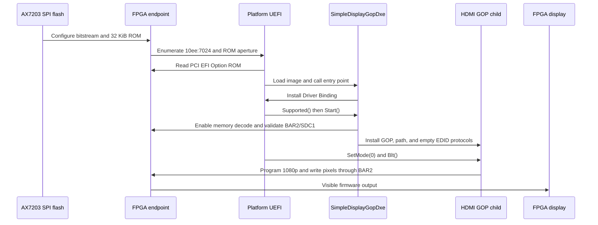

# Option ROM and Boot Flow

## Purpose

The Expansion ROM makes `SimpleDisplayGopDxe.efi` available before an OS or USB
filesystem exists. The platform firmware can discover the driver through the
PCI function, execute it, bind it to the display controller, and use the
resulting GOP for firmware setup and the bootloader.

The design contains three related but distinct artifacts:

| Artifact | Role |
|---|---|
| `SimpleDisplayGopDxe.efi` | X64 UEFI boot-service driver |
| `simple_display_gop_option_rom.bin` | Complete 32 KiB PCI EFI Option ROM |
| `simple_display_gop_option_rom_32.mem` | 32-bit-word initialization for the FPGA ROM RTL |

## PCI EFI Image Contract

The finalized ROM checker requires:

- exactly 32768 bytes;
- `55 aa` PCI ROM signature;
- 64 512-byte image blocks in the EFI and PCIR lengths;
- EFI ROM signature `0x0ef1`;
- machine type `0x8664` (X64);
- subsystem `0x000b` (EFI boot-service driver);
- compression type zero;
- PCIR identity `10ee:7024` and class `0x038000`;
- PCIR code type `0x03` for EFI;
- last-image flag set;
- whole-image byte sum equal to zero; and
- the embedded driver byte-for-byte identical to the cold-tested EFI file.

The embedded payload is PE32+ and retains the boot-service-driver subsystem.
`finalize_efi_option_rom.py` pads unused space with `0xff`, fixes both image
lengths, and adjusts the final byte to produce the checksum.

## Packaging Trust Gate

`scripts/package_gop_option_rom.sh` defaults to the accepted 1080p cold-bind
record and its tested driver/test application. Before invoking EDK II `EfiRom`,
it runs the evidence checker against those exact binaries. Packaging stops if
the evidence is absent, a hash differs, the expected GOP contract is missing,
or the pinned `EfiRom` tool is unavailable.

This enforces:

```text
source build
  -> cold manual bind and GOP validation
  -> sealed driver hash
  -> exact tested driver embedded in ROM
```

A later firmware source change invalidates the chain until the rebuilt binary
passes the manual gate and is resealed.

## XDMA Integration

Expansion ROM support is applied at several generated-IP layers:

1. The outer XDMA configuration enables `Bypass_AXI_Master`, fixes the size at
   32 KiB, and maps BAR ID 6 to AXI `0x01000000`.
2. The nested `pcie_7x` child enables its Expansion ROM with the same aperture
   and produces the matching `xrom_bar` mask.
3. Generated target-request decoding maps `m_axis_rx_tuser[8]` to internal BAR
   ID 6.
4. A same-clock AXI splitter routes the ROM request to the dedicated read-only
   slave without changing BAR2's display/control path.
5. The ROM endpoint reads the generated 32-bit memory file and supports bursts,
   AXI IDs, `RLAST`, and backpressure.

Generated source is volatile. The tracked flow reapplies and checks these
requirements after XDMA regeneration and forces the accepted patched source
through out-of-context synthesis.

## Cold Boot Sequence



GRUB subsequently uses the same GOP child. No USB `load`, Shell `connect`, or
bring-up application is part of this automatic path.

## Persistent FPGA Configuration

The Option ROM is part of the FPGA design, so host cold boot requires the
AX7203 to configure early enough for PCI enumeration. The accepted deployment
programs the complete FPGA configuration into the board's
`mt25ql128-spi-x1_x2_x4` flash and verifies it. A full shutdown/power-on, not
only a live JTAG load, is the persistence gate.

JTAG programming can replace the endpoint after the host has already
enumerated PCIe. An immediate `rev ff` or missing BDF in that situation is
stale enumeration, not meaningful ROM evidence. Reboot or power-cycle before
judging the newly programmed design.

## Firmware Evidence Layers

| Observation | What it proves | What it does not prove |
|---|---|---|
| ROM BAR and 32 KiB size | Aperture advertised | Correct bytes or EFI execution |
| Three exact Linux reads | ROM transport and image identity | Firmware dispatch |
| LoadedImage + DriverBinding | EFI image executed | Controller bound or GOP child |
| Controller associated with driver | Driver selection/dispatch | Successful `Start()` |
| FPGA GOP child exists | Binding and protocol installation | Correct BLTs or visible output |
| `GOP_TEST_PASS` | Protocol behavior for the tested driver | Automatic ROM path unless no manual load occurred |
| Visible BIOS/GRUB | Real firmware consumer and scanout | Linux DRM handoff |
| SPI cold boot | Persistence | Long-run boot reliability |

## Transition to Linux

The GOP reports `PixelBltOnly` with no linear framebuffer, so Linux must not
construct a simple-framebuffer mapping for BAR2 from GOP fields. After boot,
the PCI device enumerates normally and `fpga_drm` binds it, configures the
Linux-preferred 1080p mode, and takes over display updates.

The Linux driver does not call back into the UEFI driver. Ownership transfers
by the normal firmware-to-OS boot boundary and PCI driver binding.

## Recovery Checkpoints

Historical 4 KiB transport-only and transport-plus-SDC1 images remain useful
for diagnosis, but Git history selects those hardware checkpoints. The active
build does not use a runtime `stage` variable and must not silently substitute
a transport image for the accepted 32 KiB EFI configuration.
