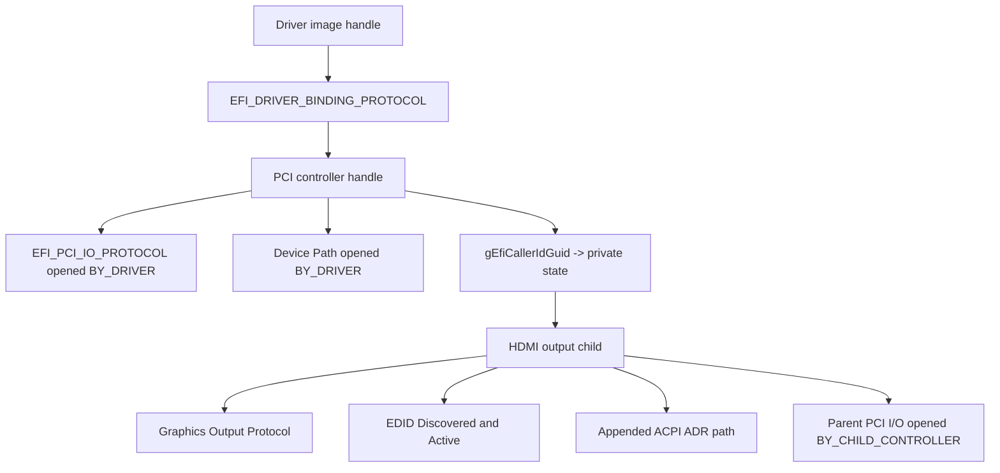

# State and Ownership

## Objects and Relationships

The controller is the PCI function. The child is the physical HDMI output.
GOP belongs on the child because display-output protocols describe a produced
graphics device, while PCI ownership and resource access remain anchored on
the parent.

## Private State

`SIMPLE_DISPLAY_PRIVATE` is the ownership ledger. Its signature validates
container recovery from GOP and protects repeated Driver Binding calls. It
tracks:

- controller and child handles;
- the parent's PCI I/O and device path;
- original UEFI PCI attributes and raw Command word;
- whether attribute/Command snapshots are valid;
- whether memory decoding was enabled by this start;
- whether the child-controller PCI I/O relationship is open;
- BAR2/SDC1 hardware context;
- allocated child device path;
- GOP mode state; and
- empty EDID protocol instances.

Flags are cleared only after the associated state is restored or resource is
released. If cleanup fails, enough state remains for `Stop()` to retry rather
than freeing an object whose ownership is still visible to firmware.

## PCI State Ownership

Before child initialization, the driver saves both:

1. `EFI_PCI_IO_PROTOCOL.Attributes(Get)`; and
2. the raw 16-bit PCI Command register.

The raw Command bits for I/O, memory, and bus master are treated as hardware
authority and reconciled into the saved abstract attributes. This handles
firmware whose PCI I/O attribute cache disagrees with the raw register after
Option-ROM dispatch.

Child start enables only PCI memory decoding. The GOP path uses programmed I/O
transactions and does not require PCI bus mastering. Child stop restores the
saved abstract state, then writes and verifies the exact original Command word.

## Protocol Open Ownership

| Open | Agent/controller | Lifetime |
|---|---|---|
| Parent PCI I/O `BY_DRIVER` | Driver Binding handle / parent | Parent-managed state through full stop |
| Parent device path `BY_DRIVER` | Driver Binding handle / parent | Parent-managed state through full stop |
| Parent PCI I/O `BY_CHILD_CONTROLLER` | Driver Binding handle / child | HDMI child lifetime |
| CallerId private protocol | Installed on parent | Parent-managed state through full stop |

The child relationship tells UEFI that the bus driver consumes the parent's
PCI I/O resource to produce that child. Child stop closes it before protocol
uninstall and attempts to restore it if uninstall fails.

## GOP Mode State

The GOP mode object has two significant states:

| State | `Mode` | BLT behavior |
|---|---:|---|
| Child installed, no selected mode | `MAX_UINT32` | `EFI_NOT_READY` |
| Mode 0 selected | `0` | All validated operations available |

Mode information is initialized early so firmware can inspect the object, but
the sentinel `Mode` prevents framebuffer traffic until `SetMode()` successfully
programs hardware.

## BLT Serialization

There is no threaded scheduler or interrupt completion path. `Blt()` validates
and allocates outside the critical region, raises to `TPL_NOTIFY` for ordered
framebuffer row operations, restores the caller's TPL, and then releases any
temporary row buffer.

The policy serializes Boot Services callers of this driver. It is not a runtime
or multiprocessor memory-sharing contract after `ExitBootServices()`.

## Disconnect Policy

Stopping the child removes its protocols, frees its path and hardware context,
and restores PCI state. It intentionally does not blank or reset the FPGA
pipeline. The last frame can remain in DDR and the pipeline can remain
programmed, but no GOP interface remains for new consumers.

This separates API ownership from destructive display shutdown and makes
targeted disconnect/reconnect validation observable. Full parent stop occurs
only after the child is gone.

## iGPU Coexistence

The motherboard iGPU and Simple Display GOP are independent handles. Manual
validation uses the iGPU-hosted Shell as a stable console and targets only the
FPGA controller for connect/disconnect. Success requires:

- two GOP handles after FPGA binding;
- one iGPU GOP after FPGA child disconnect; and
- two GOP handles again after FPGA reconnect.

The Simple Display test identifies its child by the complete GOP/EDID/mode
contract rather than relying on handle enumeration order.

## OS Ownership Transfer

UEFI protocols are Boot Services interfaces. The accepted GOP exposes no
linear framebuffer and does not define an OS runtime handoff structure.
Following `ExitBootServices()`, Linux discovers the PCI function normally and
`fpga_drm` becomes its sole driver owner.

Firmware can leave the last frame and pipeline state active during the gap,
but Linux must program the hardware for its own contract. GOP and DRM are not
concurrent owners and their validation results remain independent.
