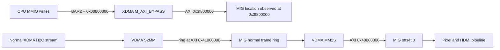

# Historical Intended 8 MiB Address Contract

> Historical record: “final” refers to the superseded July 15 8 MiB
> experiment. The current contract is
> [Current Hardware and Driver Contract](../shared_32m_ddr_gop_prerequisite/01_current_contract.md).

## Historical evidence

The values below preserve the intended July 15 contract reconstructed from the
dated test log and captured diagnostics. They do not describe the current
`PCIe.hwh`, `PCIe.tcl`, driver constants, or strict checker, all of which now
target the July 16 shared 32 MiB mapping.

Use the [current hardware contract](../shared_32m_ddr_gop_prerequisite/01_current_contract.md)
for implementation.

## PCI resources

| Resource | Current value | Use |
|---|---:|---|
| PCI function | `10ee:7024`, class `038000` | Xilinx display controller matched by `fpga_drm` |
| BAR0 | 64 KiB | XDMA configuration registers |
| BAR2 | 32 MiB, 64-bit prefetchable | XDMA bypass aperture for video registers and the DDR framebuffer slice |
| Bypass translation | `0x3f000000` | Base bits inserted into M_AXI_BYPASS addresses |
| Expansion ROM | Disabled | GOP Option ROM remains future work |

## Master-relative AXI maps

| Master/path | AXI range | Size | Purpose |
|---|---:|---:|---|
| `M_AXI_BYPASS` | `0x3f000000-0x3f00ffff` | 64 KiB | Pixel unpack |
| `M_AXI_BYPASS` | `0x3f010000-0x3f01ffff` | 64 KiB | Video timing controller |
| `M_AXI_BYPASS` | `0x3f020000-0x3f02ffff` | 64 KiB | HDMI AXI IIC |
| `M_AXI_BYPASS` | `0x3f030000-0x3f03ffff` | 64 KiB | AXI UART Lite |
| `M_AXI_BYPASS` | `0x3f040000-0x3f04ffff` | 64 KiB | AXI VDMA registers |
| `M_AXI_BYPASS` | `0x3f050000-0x3f05ffff` | 64 KiB | Color conversion |
| `M_AXI_BYPASS` | `0x3f060000-0x3f06ffff` | 64 KiB | Video clock wizard |
| `M_AXI_BYPASS` | `0x3f070000-0x3f07ffff` | 64 KiB | Video-lock GPIO |
| `M_AXI_BYPASS` | `0x3f800000-0x3fffffff` | 8 MiB | MIG DDR framebuffer/scratch slice |
| VDMA MM2S/S2MM | `0x40000000-0x7fffffff` | 1 GiB | Full MIG DDR mapping for video DMA |

## BAR2 host offsets

For every used range, the driver verifies both ends using the actual XDMA
composition:

```text
emitted_AXI_address = 0x3f000000 OR BAR2_offset
```

| BAR2 host offset | Emitted bypass AXI range | Use |
|---:|---:|---|
| `0x00000000-0x0007ffff` | `0x3f000000-0x3f07ffff` | Video-control IPs |
| `0x00800000-0x00ffffff` | `0x3f800000-0x3fffffff` | DDR3 bypass window |
| `0x00800000-0x00fe8fff` | `0x3f800000-0x3ffe8fff` | Maximum GOP XRGB8888 frame |
| `0x00fff000-0x00ffffff` | `0x3ffff000-0x3fffffff` | Reserved non-destructive scratch page |
| `0x01000000-0x01ffffff` | Aliases lower AXI addresses | Intentionally unused |

The historical proposal would have published:

```text
historical FrameBufferBase = PCI BAR2 physical base + 0x00800000
```

That formula is retained only to explain the failed experiment and is not a
valid project contract. The current framebuffer offset is documented in the
shared 32 MiB package.

## Intended shared physical DDR views: disproved

The diagram below records the alias the design intended to create. Paired ILA
captures later proved that the two arrows did not terminate at the same
physical MIG bytes.



## Frame layout

| Item | Bypass AXI view | VDMA AXI view | Size/count |
|---|---:|---:|---:|
| Intended GOP/test framebuffer alias | `0x3f800000` | `0x40000000` | Disproved by paired ILA; not one physical frame |
| Scratch page | `0x3ffff000` | Not used by VDMA | 4 KiB |
| Normal Linux ring | Not used through bypass | `0x41000000-0x42fa6fff` | Four frames |

The maximum supported frame is `1920 * 1080 * 4 = 0x7e9000` bytes. It fits
inside 8 MiB and leaves `0x17000` bytes; the final 4 KiB is reserved for the
scratch test. Reducing the bypass-visible slice to 8 MiB did not reduce VDMA's
1 GiB DDR mapping or the normal four-frame count.
