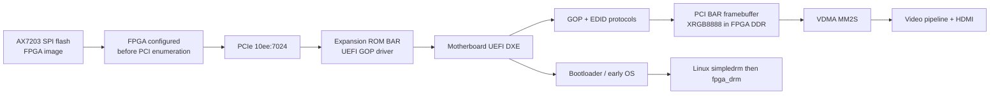

# UEFI GOP Research for Simple Display Controller

## Conclusion

Graphics Output Protocol (GOP) is the correct interface if this PCIe display
controller should show UEFI setup, firmware menus, a bootloader, and early OS
boot graphics before `fpga_drm.ko` loads.

GOP is not an FPGA protocol and it is not an extension of the Linux DRM
driver. It is a UEFI boot-service protocol produced by a UEFI PCI driver. For
this project, firmware must:

1. enumerate the configured FPGA as a PCI display controller;
2. obtain and execute our UEFI driver, initially from an EFI System Partition
   and ultimately from the card's PCI Expansion ROM;
3. let that driver initialize the HDMI/video pipeline;
4. install `EFI_GRAPHICS_OUTPUT_PROTOCOL` and EDID protocols; and
5. leave a visible framebuffer scanning out when the OS calls
   `ExitBootServices()`.

This provides output during the UEFI phase, not from the first instant of
power-on. The FPGA must finish loading from SPI flash and the PCIe endpoint must
be ready before firmware enumerates the bus.

## Recommended architecture

Add a host-visible linear framebuffer aperture into FPGA DDR and expose it
through a PCI BAR. Write an EDK II UEFI driver that reports that aperture as
the GOP framebuffer and programs the existing VDMA, VTC, clock, pixel, HDMI,
and I2C blocks. Package the driver as a UEFI PCI Option ROM and serve that ROM
from FPGA BRAM through the XDMA Expansion ROM interface.

The direct BAR framebuffer is preferred over reproducing the Linux XDMA
streaming driver inside UEFI. It gives GOP consumers the linear
`FrameBufferBase` they expect, avoids bus-master DMA in the first driver, and
provides a normal firmware-framebuffer handoff to the OS.

## Current project findings

Research plus live probing through 2026-07-15 found:

| Item | Current state | GOP consequence |
|---|---|---|
| Host boot mode | UEFI | Suitable for an X64 GOP driver. |
| Secure Boot | Unsupported/off on this AMI B85 host | Unsigned development drivers can be tested here; production signing remains a portability requirement. |
| FPGA PCI identity | `10ee:7024`, class `038000` | A UEFI PCI driver can match it. Firmware console-selection behavior must be tested because the Intel iGPU is also present. |
| BAR0 | 64 KiB, non-prefetchable | XDMA control registers. |
| BAR2 | 32 MiB, 64-bit prefetchable | Uses only non-aliased host offsets `0x00000000-0x00ffffff`; the upper half remains unused. |
| Expansion ROM | Disabled; config register `0x30` is zero | Firmware has no card-local driver to load. |
| Frame transport | XDMA H2C AXI stream into VDMA S2MM | Works for Linux, but is not a directly writable GOP framebuffer. |
| Frame storage | VDMA has 1 GiB at `0x40000000-0x7fffffff`; bypass maps the first 8 MiB at `0x3f800000-0x3fffffff` | Different master addresses can select the same MIG offsets; the normal four-frame ring remains at `0x41000000`. |
| Direct bypass test | Static contract, scratch save/write/read/restore, `1280x720` frame write, and AXI ILA all pass | The framebuffer mechanism needed by a first GOP driver is proved; maximum-resolution and firmware validation remain. |
| Power-on image path | `PCIe_wrapper.bin` can be programmed into `mt25ql128` SPI flash | Correct place for the deployable FPGA image. Cold-boot timing still needs measurement. |

The updated export adds an 8 MiB MIG segment at bypass AXI
`0x3f800000-0x3fffffff`, reached through host offsets
`0x00800000-0x00ffffff`. These offsets do not overlap the set translation bits,
so the addresses are representable. Bypass and VDMA use different numeric AXI
addresses for MIG offset zero. The export still records
`PF0_EXPANSION_ROM_ENABLE=FALSE`.

The completed hardware evolution, driver implementation, ILA evidence, and
remaining GOP handoff are documented in
[PCIe DDR bypass GOP prerequisite](../development_work/pcie_ddr_bypass_gop_prerequisite/README.md).

Relevant repository evidence:

- [`fpga_hardware/PCIe_wrapper/PCIe.tcl`](../../fpga_hardware/PCIe_wrapper/PCIe.tcl)
  contains the currently exported XDMA configuration, H2C stream connection,
  bypass connection, and address map.
- [`fpga_hardware/PCIe_wrapper/PCIe.hwh`](../../fpga_hardware/PCIe_wrapper/PCIe.hwh)
  records PCI class `0x038000`, device `0x7024`, and Expansion ROM disabled.
- [`Linux_DRM_Driver/fpga_drm/fpga_drm_drv.c`](../../Linux_DRM_Driver/fpga_drm/fpga_drm_drv.c)
  is the reusable reference for mode timings and video-IP programming.
- [`vivado_project/scripts/program_spi_from_bin.tcl`](../../vivado_project/scripts/program_spi_from_bin.tcl)
  is the existing deploy-to-SPI path.

## Research documents

- [GOP and PCI Option ROM mechanism](01_gop_and_option_rom_mechanism.md)
- [Required FPGA hardware changes](02_hardware_architecture.md)
- [UEFI driver design](03_uefi_driver_design.md)
- [Where source and images live, and how they load](04_storage_build_and_loading.md)
- [Implementation and validation plan](05_implementation_plan.md)

## Decision summary

| Decision | Recommendation |
|---|---|
| Firmware API | UEFI GOP, not legacy VGA BIOS/VBE. |
| First mode | Fixed `1280x720@60`, reusing the live-validated bypass/VDMA setup; then add EDID-filtered modes including `1024x768@60`. |
| Pixel layout | GOP `PixelBlueGreenRedReserved8BitPerColor`, matching little-endian DRM `XRGB8888` byte layout. |
| Frame transport in GOP | CPU writes to a PCI BAR mapped to FPGA DDR. |
| Final driver location | UEFI PCI Option ROM served by FPGA BRAM. |
| Development driver location | USB or system EFI System Partition, loaded from UEFI Shell first. |
| FPGA image location | AX7203 `mt25ql128` SPI configuration flash. |
| Linux takeover | Evict `simpledrm`/firmware framebuffer with the kernel aperture helper before `fpga_drm` takes ownership. |
| MicroBlaze | Not required for the recommended design. |

The concrete implementation order, firmware contract, and failure-isolation
gates are maintained in the
[GOP firmware development package](../development_work/gop_firmware_implementation/README.md).

## Primary references

- [UEFI 2.11, Graphics Output Protocol and PCI graphics rules](https://uefi.org/specs/UEFI/2.11/12_Protocols_Console_Support.html#graphics-output-protocol)
- [UEFI 2.11, PCI Option ROMs](https://uefi.org/specs/UEFI/2.11/14_Protocols_PCI_Bus_Support.html#pci-option-roms)
- [EDK II Driver Writer's Guide, PCI Option ROM distribution](https://tianocore-docs.github.io/edk2-UefiDriverWritersGuide/draft/32_distributing_uefi_drivers/321_pci_option_rom.html)
- [AMD PG195, PCIe BAR and Expansion ROM configuration](https://docs.amd.com/r/en-US/pg195-pcie-dma/PCIe-BARs-Tab)
- [AMD PCIe address translation alignment checks](https://docs.amd.com/r/en-US/pg194-axi-bridge-pcie-gen3/Addressing-Checks)
- [AMD PG054, 7-series PCIe configuration timing](https://docs.amd.com/r/en-US/pg054-7series-pcie/Configuration-Access-Specification-Requirements)
- [Linux 6.8 DRM documentation, firmware framebuffer ownership](https://docs.kernel.org/6.8/gpu/drm-internals.html#managing-ownership-of-the-framebuffer-aperture)
